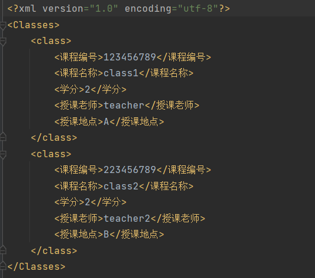
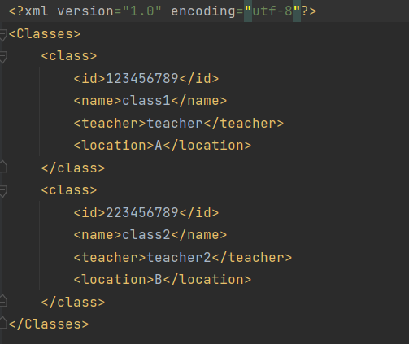
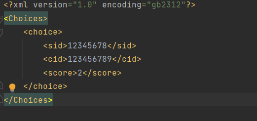
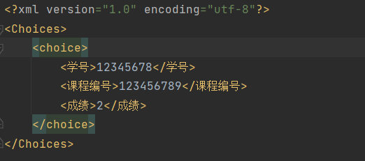
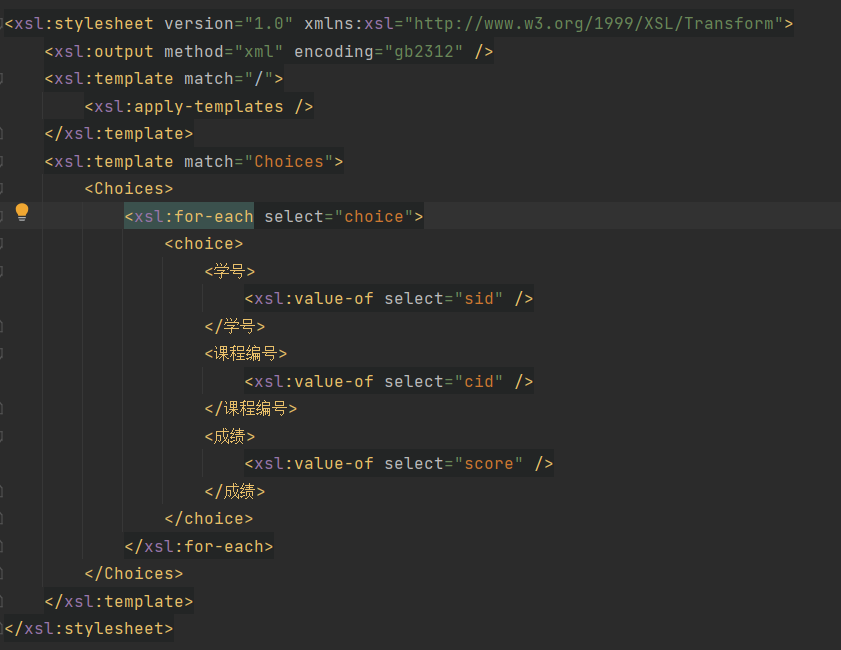
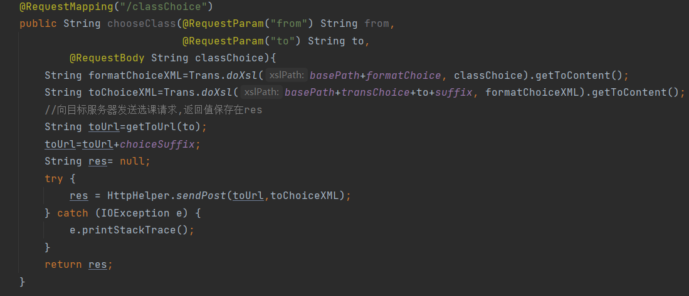

# 
39组-路线一-报告

## 集成端

- 格式化XML
    - 使用xslt将外部传入的XML格式化
    - classA.xml  
    

    - class.xml  
    

    - formatClass.xsl  
    
    

- 将标准XML转化为服务器需要的XML
    - choice.xml  
    

    - choiceA.xml  
    

    - choiceToA.xsl  
    

- 使用上述功能即可完成跨院系选课
    - 将院系服务器发送的选课xml格式化，根据目标服务器重新转换为目标服务器所需格式  
    